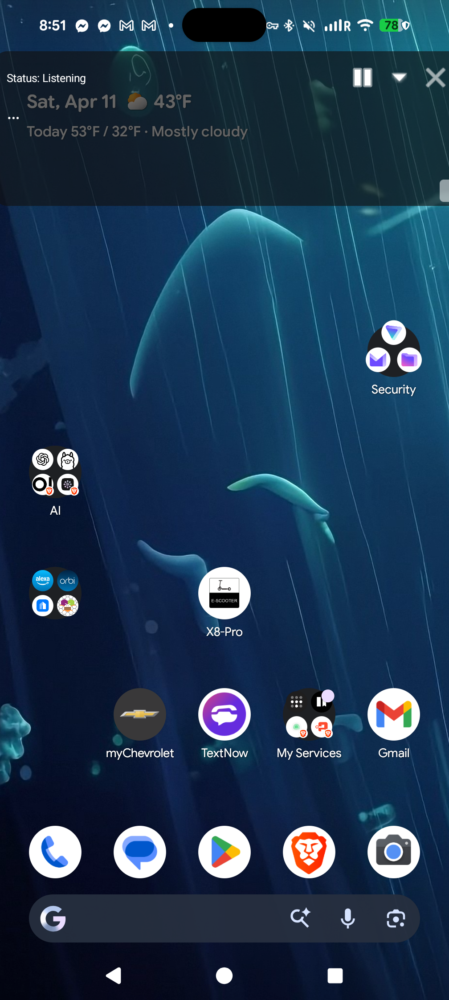
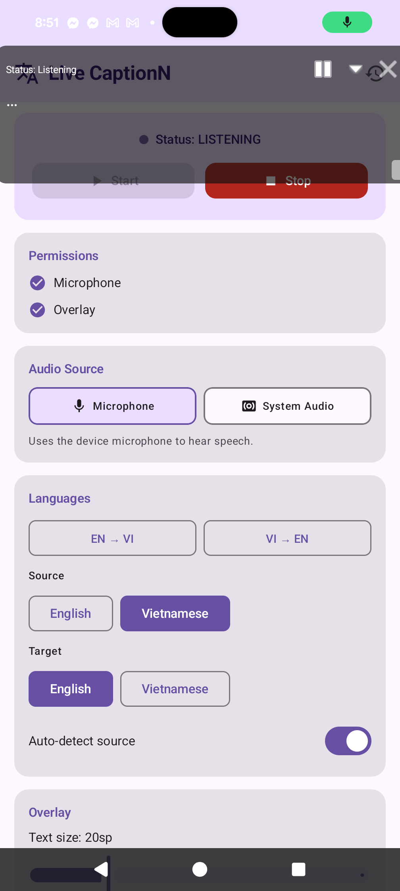
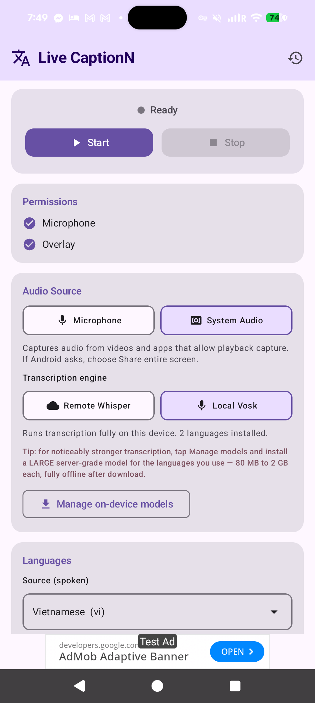
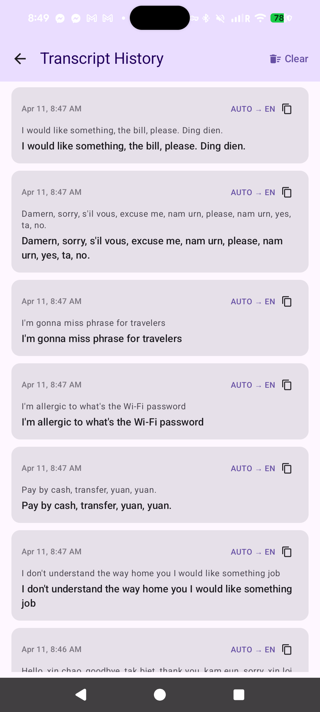

<div align="center">

# LiveCaptionN

**Real-time speech transcription and EN ⇄ VI translation, floating over any Android app.**

[](https://github.com/chartmann1590/LiveTranscribe-Android/actions/workflows/build.yml)
[](https://github.com/chartmann1590/LiveTranscribe-Android/releases/latest)
[](LICENSE)
[](#requirements)

### [Website](https://chartmann1590.github.io/LiveTranscribe-Android/) · [Download APK](https://github.com/chartmann1590/LiveTranscribe-Android/releases/latest) · [Report an issue](https://github.com/chartmann1590/LiveTranscribe-Android/issues)

</div>

---

LiveCaptionN listens through the microphone (or the currently playing app audio), transcribes what it hears in **real time** — word by word as you speak — translates between any supported language pair, and paints the result as a draggable caption window on top of whatever you are watching or browsing. It is built for people watching foreign-language videos, following along in a meeting, or studying another language hands-free.

Both stages of the pipeline can run **fully on-device**: streaming Vosk handles speech-to-text (one long-lived recognizer fed ~100 ms audio chunks continuously), and Google ML Kit handles the text-to-text translation with ~59 languages cached offline after a one-time ~30 MB per-pair download. No server required. If you would rather use a LibreTranslate server for wider language coverage or a Whisper ASR endpoint for STT, both paths are still available in settings.

## Screenshots

<div align="center">

&nbsp;&nbsp;
&nbsp;&nbsp;
&nbsp;&nbsp;


</div>

## Features

- **Floating caption overlay** — draggable, resizable `SYSTEM_ALERT_WINDOW` window that sits on top of any app, with Pause, Minimize, and Close controls.
- **Live streaming on-device recognition** — a continuous Vosk pipeline feeds ~100 ms PCM chunks into one long-lived recognizer and emits partial results as the words are spoken (not batched 2-second chunks), so captions feel like Google Live Caption.
- **Mic _and_ system audio, same engine** — switch between the microphone and `MediaProjection` audio capture without changing backends. Both paths stream through the same low-latency pipeline.
- **Multiple speech engines** — streaming on-device Vosk (default), Android's on-device `SpeechRecognizer` (Android 12+, same engine as Google Live Caption), or a remote Whisper HTTP endpoint as a fallback.
- **On-device translation via ML Kit** — Google's pre-trained Translate models run entirely on the phone. ~59 supported languages, ~30 MB per language pair (one-time download), cached offline forever after that. LibreTranslate is still available as an alternative backend for wider coverage.
- **Any language your backend supports** — the picker shows ML Kit's supported languages, your LibreTranslate server's `/languages` list, or only the Vosk models installed on this phone, whichever combination you choose.
- **Built-in Vosk model downloader** — two quality tiers: **Small** (~30–80 MB, fast and light) and **Large** server-grade models (80 MB to 2 GB, lowest error rates) for Spanish, French, German, Russian, Chinese, Japanese, Hindi, Arabic, and more.
- **Automatic update notifications** — a background WorkManager job polls the GitHub releases API; when a new version is published you get a system notification with a one-tap Download action, plus an in-app banner the next time you open the app.
- **Transcript history** — every session is saved locally and searchable from the history screen.
- **Tunable overlay** — text size, opacity, width/height, "show original" toggle, minimized state, and remembered screen position.
- **Private by default** — speech processing and translation both run against endpoints you configure. No accounts, no telemetry.

## Translating different languages

LiveCaptionN is a two-stage pipeline: **speech → text** happens in a speech engine, then **text → text** happens in LibreTranslate. You can mix and match.

### Path A — LibreTranslate (broad language coverage)

Point the app at any LibreTranslate-compatible server and it fetches `GET /languages` on startup (and whenever you change the URL). Whatever the server reports shows up in both the Source and Target pickers — typically English, Spanish, French, German, Italian, Portuguese, Russian, Chinese, Japanese, Korean, Arabic, Hindi, Vietnamese, and ~15 more depending on which Argos Translate packages are installed.

To add more languages, install extra packages on the server:

```bash
# On the machine running LibreTranslate
argospm update
argospm install translate-en_ja translate-en_ko translate-en_fa
# …then restart LibreTranslate
```

See the [LibreTranslate docs](https://github.com/LibreTranslate/LibreTranslate#install-argos-translate-packages) for the full list.

### Path B — On-device Vosk (offline, no server needed for STT)

When you select **System Audio → Local Vosk** the source-language picker collapses to just the Vosk models that are installed on this phone. Two models ship inside the APK (English and Vietnamese). Tap **Manage on-device models** to download additional ones — the app fetches them from `alphacephei.com/vosk/models` over HTTPS, unzips to app-private storage, and instantly makes that language available in the picker. Uninstalling frees the disk space.

> On-device transcription still uses LibreTranslate for the text → text step, so you need the translation server reachable if you want captions in a different language than the one being spoken. If the source and target match (for example, English speech → English captions), no translation call is made.

## Quick install

1. Download the latest APK from the [releases page](https://github.com/chartmann1590/LiveTranscribe-Android/releases/latest).
2. On your Android device, enable **Install unknown apps** for your browser / file manager if prompted.
3. Open the APK and install.
4. Launch LiveCaptionN and grant **Microphone**, **Display over other apps**, and **Notifications** permissions. (Notifications are used for update alerts only — no telemetry.)
5. (Optional) Point the Translation base URL at your own LibreTranslate server.
6. Tap **Start Captioning**, then switch to any app you want to watch or listen to.

After install, the app checks the GitHub Releases API roughly twice a day in the background. When a new version ships, you'll get a notification with a one-tap Download action — and an in-app banner on the main screen the next time you open the app.

> Minimum Android version: **Android 10 (API 29)**. Target: **Android 15 (API 35)**.

## How it works

```
┌─────────────┐    ┌─────────────────────────┐    ┌────────────────┐    ┌──────────────┐
│ Mic / Media │ ─▶ │ StreamingSttEngine      │ ─▶ │ Translation    │ ─▶ │ Floating     │
│ Projection  │    │ (100ms chunks → Vosk    │    │ (LibreTranslate│    │ overlay on   │
│ audio       │    │  streaming recognizer)  │    │  HTTP server)  │    │ other apps   │
└─────────────┘    └─────────────────────────┘    └────────────────┘    └──────────────┘
```

One `AudioRecord` reads 16 kHz mono PCM in ~100 ms chunks from either the microphone (`VOICE_RECOGNITION`) or `AudioPlaybackCaptureConfiguration`, feeds each chunk straight into a long-lived Vosk `Recognizer`, and emits **partial** results (`isFinal=false`) every chunk plus **final** segments on Vosk's silence boundaries. A foreground `CaptionForegroundService` wires everything together, debounces translation requests (~400 ms), and pushes updates into a `StateFlow` that both the Compose main screen and the Android-Views overlay observe.

## Architecture at a glance

- **MVVM with manual DI** — all dependencies wired through `AppContainer` (created in `LiveCaptionApp`). No Hilt.
- **`TranslationRepository`** — abstraction with `LibreTranslateRepository` (Retrofit) and `MockTranslationRepository` for tests.
- **`SpeechEngine`** — abstraction implemented by `StreamingSttEngine` (default, streaming Vosk for mic and system audio), `AndroidSpeechRecognizerManager` (platform on-device recognizer, Android 12+), and `SystemAudioEngine` (legacy batch path that POSTs WAVs to a remote Whisper endpoint).
- **`VoskStreamingSession`** — keeps one `Recognizer` alive for the whole session so partial results stay coherent across chunks.
- **`UpdateChecker` + `UpdateCheckWorker`** — WorkManager periodic job that queries the GitHub Releases API, compares against `BuildConfig.VERSION_CODE`, and posts a notification via `UpdateNotifier` when a new build is out.
- **`CaptionRuntimeStore`** — in-memory `MutableStateFlow` holding live caption state.
- **`SettingsRepository`** — DataStore Preferences persistence for every user-visible setting plus overlay position.
- **Overlay** — traditional Android Views via `WindowManager` (Compose does not play well with `SYSTEM_ALERT_WINDOW`).

For deeper notes see [`CLAUDE.md`](CLAUDE.md).

## Translation backend

LiveCaptionN talks to any LibreTranslate-compatible server. The default endpoint is `http://localhost:3006` and is configurable in the main screen.

- `GET /languages` — list supported languages
- `POST /translate` — body: `{ q, source, target, format: "text" }`

You can self-host LibreTranslate with Docker in a few minutes — see the [LibreTranslate project](https://github.com/LibreTranslate/LibreTranslate).

## Build from source

Requires **JDK 17** and the Android SDK. Tested with Android Studio Hedgehog+.

```bash
# Clone
git clone https://github.com/chartmann1590/LiveTranscribe-Android.git
cd LiveTranscribe-Android

# Debug APK
./gradlew assembleDebug

# Release APK (unsigned)
./gradlew assembleRelease

# Unit tests
./gradlew test

# Instrumentation tests (connected device required)
./gradlew connectedAndroidTest
```

Output APKs land in `app/build/outputs/apk/`.

## Requirements

| Item | Value |
|---|---|
| Min SDK | 29 (Android 10) |
| Target / Compile SDK | 35 (Android 15) |
| Language | Kotlin |
| UI | Jetpack Compose + Material 3 (main), Android Views (overlay) |
| Build tool | Gradle 8 + AGP |

## Tech stack

Kotlin · Coroutines & Flow · Jetpack Compose · Material 3 · Retrofit · OkHttp · Moshi · DataStore Preferences · Vosk · WindowManager · MediaProjection · Foreground Service

## Roadmap

- Additional language pairs beyond EN ⇄ VI
- On-device translation models
- Accessibility-service experiments for richer in-app context
- Per-app overlay profiles

## Contributing

Issues and pull requests are welcome. Before opening a PR:

1. Run `./gradlew test` and make sure it passes.
2. Keep changes focused — one concern per PR.
3. If you change overlay rendering, include a screenshot.

## License

See [`LICENSE`](LICENSE).
